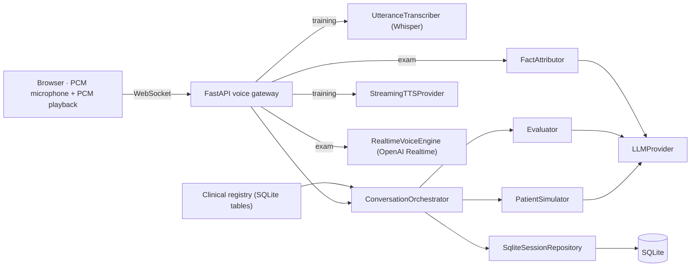

# ARI — entraînement à la communication médicale en allemand

ARI is a local-first trainer for the German medical language exam (FSP). A learner
creates a local profile, then practises with published, versioned clinical content:

- **Arzt–Patient, training**: a push-to-talk voice consultation with a simulated
  patient. The learner presses *Parler*, speaks, presses *J’ai fini*; Whisper transcribes
  the utterance, an LLM picks which case facts the patient may reveal, application code
  renders the exact patient sentence, TTS plays it back, and the browser acknowledges
  playback before any fact is credited as heard. A structured evaluation follows at the
  end of the session.
- **Arzt–Patient, exam**: the same consultation with an open microphone. Browser audio
  is relayed to one speech-to-speech model briefed with the authored case; the model
  speaks freely, the learner may interrupt it. After each answer an LLM audit maps the
  spoken sentence back to authored facts, and the same playback acknowledgement credits
  them. The transcript stays hidden until the session ends.
- **Arzt–Arzt** and **Fachbegriffe**: deterministic text exercises with authored answer
  variants. No AI call is involved.
- **Personal lexicon**: every analysed voice session feeds a per-learner word list
  (evaluator candidates tagged missing or misused, case terms the learner never used,
  words said in another language) with spaced-repetition review (`srs-sm2-v1`). A word
  is promoted to *used* only when the learner says it spontaneously in a later session,
  and to *mastered* after two such sessions and three successful reviews. In training a
  question asked in another language than the case gets the authored off-topic answer
  and is recorded as `wrong_language`, never a fact.
- **Structure and empathy**: a scenario may map its facts to the canonical FSP
  anamnesis sections (deterministic coverage checklist) and flag empathy moments (a
  disclosure the doctor should acknowledge). The trigger is deterministic; only the
  verdict on the learner's next turn is asked of the LLM, with the turn as evidence.
  Each feedback ends with at most three next actions derived from these signals.
- **Profile and placement test**: the onboarding facts (declared level, certificate,
  exam date, minutes per day, Land, specialty) live in the learner profile. A short
  placement test (`placement-staircase-v1`: adaptive MCQ, four listening items read by
  the TTS provider, two spoken tasks transcribed and rated by the LLM) yields an
  *estimated* level per skill and an overall band stored as `estimated_level`. Its
  content is a separate registry bundle (`ari-placement-bundle-v1`) with one linguistic
  review; see `docs/CLINICAL_CASES.md`.
- **Weekly programme** (`program-rules-v1`): a learner model is computed on every read
  from deterministic signals only (reference level, lexicon due words, section coverage
  over the last sessions, required items missed, empathy verdict counts, recent
  activity, exam horizon) and turned into this week's slots, bounded by the declared
  minutes per day. Phases: positionnement, prérequis (below B1, with the general-German
  prerequisite stated as information to verify per Land), fondations, anamnèse, examen.
  Recommended content scores published cases by overlap with due lexicon words, weak
  sections and recency. Nothing is stored: the plan is recomputed, done slots are matched
  against what was completed since Monday.
- **Progression by axis** (`progress-axes-v1`): anamnesis structure as a heatmap of
  sections by session, empathy verdicts over time, recurring language error categories
  (the evaluator tags each error with a closed category), lexicon acquired versus active,
  weekly rhythm and placement history. The per-content comparable series remain below,
  separated by content version, rubric, method and mode. No overall score, no certified
  CEFR level, no certification.

Without published content the catalogue is empty. Content enters through the clinical
registry (import, two human reviews, publication), never through code.

## Try it offline

```sh
python3 -m venv .venv
make install-locked
PYTHONPATH=backend/src .venv/bin/python -m ari.demo --port 8010
```

Open <http://127.0.0.1:8010>. The demo creates a temporary database, runs the
migration, imports `cases/demo/ari_demo_bundle.v1.yaml`, records **simulated** reviews,
publishes one synthetic voice case and two synthetic exercises, and runs with fake
providers. In fake mode the voice page offers a text field instead of the microphone.
Nothing outside the temporary directory is read or written; Ctrl+C removes it.

## Develop with live providers, in French

You do not need to speak German to exercise the platform. `cases/dev/ari_dev_fr.v1.yaml`
is a synthetic French voice case (fiction, simulated reviews, never learner content):

```sh
make dev-fr             # http://127.0.0.1:8010
```

`.env` at the project root must define `ARI_OPENAI_API_KEY` and `ARI_STT_API_KEY` (start
from `.env.example` only if you have no `.env` yet, `cp` overwrites). Whisper goes to Groq
by default; with a single OpenAI key add:

```sh
ARI_STT_BASE_URL=https://api.openai.com/v1
ARI_STT_MODEL=whisper-1
ARI_STT_API_KEY=<same OpenAI key>
```

`make dev-fr` runs `python -m ari.demo --provider openai --database var/dev-fr.db
--bundles cases/dev`: the database persists between runs so history and progression
accumulate, and re-seeding an existing database is a no-op. When the single migration
has been regenerated since the file was created, the demo refuses to start and asks you
to delete `var/dev-fr.db`. Everything downstream follows the case language (Whisper,
Realtime transcription, patient and evaluation prompts).
Nothing changes for learners: the platform database only holds content published through
the registry, and only German cases are published there.

## Run locally

```sh
make migrate
make dev
```

`make dev` serves <http://localhost:8000> against `var/ari.db` (override with
`ARI_DATABASE_URL`). The root is the learner home; `/voice.html` is the voice page.
The catalogue stays empty until you publish content with the registry CLI (below).

For live providers set, in `.env` or the environment:

| Variable | Purpose | Default |
| --- | --- | --- |
| `ARI_PROVIDER_MODE` | `fake` or `openai` | `fake` |
| `ARI_OPENAI_API_KEY` | patient simulation, evaluation and TTS (OpenAI) | |
| `ARI_STT_API_KEY` | Whisper transcription key (Groq by default) | |
| `ARI_STT_BASE_URL` | any OpenAI-compatible `/audio/transcriptions` host | `https://api.groq.com/openai/v1` |
| `ARI_STT_MODEL` | Whisper model | `whisper-large-v3` |
| `ARI_PATIENT_MODEL`, `ARI_EVALUATION_MODEL`, `ARI_TTS_MODEL`, `ARI_TTS_VOICE` | OpenAI models | see `backend/src/ari/config.py` |
| `ARI_REALTIME_MODEL`, `ARI_REALTIME_VOICE` | exam mode speech-to-speech model and voice (OpenAI Realtime) | `gpt-realtime-mini`, `marin` |
| `ARI_REALTIME_TRANSCRIPTION_MODEL` | learner transcript inside the Realtime session | `gpt-4o-mini-transcribe` |
| `ARI_REALTIME_VAD_SILENCE_MS` | silence before the patient answers; keep it high for A1–B1 learners | `900` |

Every session pins the voice stack it was created with: `pipeline_economy` for training
(`stt`, `llm`, `tts` model ids) or `realtime_exam` for exam (`sts`, `stt`, `llm`), plus
parameters. A session can only resume on exactly that configuration.

This is a loopback development build: cookie-based local profiles, no rate limits, no
spend controls. Do not expose it publicly.

## Architecture



Dependencies point inward:

- `domain`: session and turn state, strict Pydantic clinical authoring contracts, the
  practice (text exercise) rules; no vendor SDKs;
- `application`: ports (`LLMProvider`, `UtteranceTranscriber`, `StreamingTTSProvider`,
  `RealtimeVoiceEngine`, `Evaluator`, `SessionRepository`), patient simulation, fact
  attribution, evaluation, orchestration, progression;
- `infrastructure`: SQLite persistence, the clinical registry and its CLI, OpenAI,
  OpenAI Realtime and Whisper adapters, deterministic fakes;
- `api`: HTTP routes, the two voice WebSocket handlers (push-to-talk pipeline, open
  microphone relay), cookie ownership middleware;
- `web`: two dependency-free pages, `index.html` (practice) and `voice.html`.

In training the patient never invents facts: the LLM returns source references only,
and the application renders the authored patient phrases. Unknown references are
rejected and traced. In exam the speech model speaks freely under the same case rules;
its sentences are stored verbatim and audited afterwards, so a fact is credited only
when the audit finds it and the browser confirms playback. Prompt injection and
off-topic requests are answered in character in both modes.

### Clinical registry

Content is a YAML `ari-clinical-bundle-v1` document (see `docs/CLINICAL_CASES.md`)
with sources, rubrics, terminology, cases and scenarios. `python -m
ari.infrastructure.cases.cli --help` validates, imports, inspects, records human
reviews, publishes and withdraws. The `placement` subcommands do the same for
`ari-placement-bundle-v1` documents, with a single linguistic review. Publication requires compatible source rights and one
clinical plus one linguistic approval of the exact hashes. Content rows are immutable
(SQLite triggers). See `docs/CLINICAL_REVIEW_FR.md` for the review procedure.

## Persistence

SQLite through SQLAlchemy Core-style models; one Alembic revision creates the schema
(`docs/MIGRATIONS.md`). Turns record the facts the patient selected and, separately,
the facts credited as heard once the browser confirms full playback. Learner
transcripts are persisted before the patient answers, so a failed response never loses
a turn. `POST /api/sessions/{id}/end` is idempotent and drains the voice connection.

## API

- `POST /api/learners`, `GET /api/profile`, `DELETE /api/profile`
- `GET/PATCH /api/learners/{id}/goal`, `PATCH /api/learners/{id}/profile`,
  `GET /api/learners/{id}/sessions`
- `GET /api/placement`, `POST /api/placement/attempts`, `GET /api/placement/attempts/{id}`,
  `POST .../answers`, `GET .../items/{item_id}/audio` (WAV), `POST .../speaking/{item_id}`
  (PCM16 24 kHz body, `X-Event-Id` header; `text/plain` in fake mode), `POST .../finish`
- `GET /api/cases`
- `POST /api/sessions`, `GET /api/sessions/{id}`, `POST /api/sessions/{id}/end`,
  `POST /api/sessions/{id}/analysis/retry`
- `WebSocket /ws/sessions/{id}/voice`: binary PCM16 24 kHz frames, `user.turn.finish`,
  `audio.playback_started`, `audio.playback_completed`, `turn.retry_tts`, `call.end`;
  in fake mode `debug.transcript`. `call.started` carries `interaction`:
  `push_to_talk` (training) or `open_microphone` (exam, frames stream continuously).
- `GET /api/exercises`, `POST /api/practice/runs`, `GET /api/practice/runs/{id}`,
  `POST /api/practice/runs/{id}/{answers|pause|resume|finish}`
- `GET /api/lexicon`, `POST /api/lexicon/entries`, `PATCH /api/lexicon/entries/{id}`
  (archive), `POST /api/lexicon/entries/{id}/reviews` (idempotent per `event_id`).
  A completed session's `GET /api/sessions/{id}` carries `lexicon` (words added and
  promoted by that session) and `evaluation.code_switches`.
- `GET /api/history`, `GET /api/progression`, `GET /api/program` (learner model and
  this week's slots)

## Quality checks

```sh
make test           # backend suite + JavaScript checks and unit tests
make lint           # ruff + mypy --strict
make migration-check
```

Provider tests are offline. The browser acceptance test needs Node 22+, pnpm and
Playwright:

```sh
pnpm --dir web install --frozen-lockfile --ignore-scripts
pnpm --dir web exec playwright install chromium
PYTHONPATH=backend/src .venv/bin/python -m ari.demo --port 8010   # in another terminal
pnpm --dir web test:e2e
```

## Known limits

- The pipeline is single-process: voice connection state lives in memory, so run one
  worker. SQLite has a single writer.
- No pronunciation scoring. Lexicon promotions are lexical (a token starting with the
  term, short inflection allowed), not a judgement of correct usage; the LLM only
  proposes candidates and flags code switches. In exam mode the speech model refuses
  other languages in character, but the turn is not tagged `wrong_language`.
- Text exercises match whole answers after normalisation; unrecognised phrasings are
  reported as unrecognised, not as wrong.
- All shipped content is synthetic. Real cases require human clinical and linguistic
  review before any learner use.
