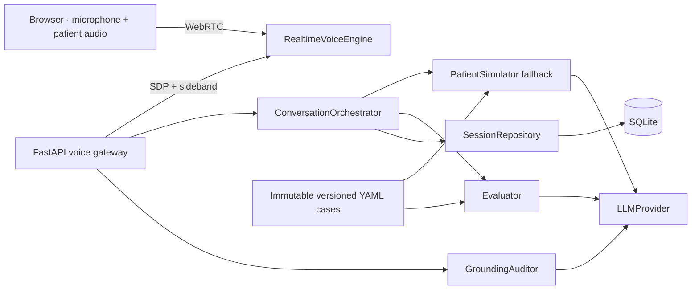

# ARI — MVP d’entraînement à la communication médicale en allemand

ARI provides onboarding, structured Arzt–Arzt and Fachbegriffe exercises, session
history and evidence-based, version-separated progression. The existing voice path
is retained behind published clinical content:

`microphone → WebRTC speech-to-speech patient → transcript → structured evaluation → SQLite`

The default provider remains `fake`. Structured exercises are deterministic and make
no AI calls. Synthetic demos are disabled by default, explicitly labeled unvalidated,
and forbidden in production. Without published content the UI shows an empty state,
not an unapproved case. 
## Try the MVP safely, offline

After installing Python dependencies, run from the repository root:

```sh
PYTHONPATH=backend/src .venv/bin/python -m ari.demo --port 8010
```

Open [http://127.0.0.1:8010](http://127.0.0.1:8010). This creates a **fresh temporary
database**, applies migrations only there, ignores `.env`, enables two synthetic
text exercises and forces fake providers. No existing application database
is read or changed. Stop with Ctrl+C: the demo history is temporary and removed.
Create a local profile, choose Training or Exam, answer, pause/reload/resume, finish,
then open History and Progression. See [Goal 5 details and limitations](docs/GOAL5_IMPLEMENTATION.md).

## Run locally

Python 3.12+ is required.

```bash
python3 -m venv .venv
make install-locked
make migrate
.venv/bin/uvicorn ari.main:app --app-dir backend/src --reload --port 8000
```

Open [http://localhost:8000](http://localhost:8000). The root is the learner home;
`/voice.html` is the voice workspace. New voice sessions require a published scenario.
The fake voice transcript field remains available for isolated integration tests.
The commands above migrate the database you explicitly select; use the temporary
demo command instead if an existing database must remain untouched.

For OpenAI-backed voice, copy `.env.example` to `.env`, set `ARI_PROVIDER_MODE=openai` and `ARI_OPENAI_API_KEY`. A deterministic internal registry selects and snapshots one versioned voice stack when a session is created:

- `realtime_economy`: `gpt-realtime-2.1-mini` (default);
- `realtime_quality`: `gpt-realtime-2.1`;
- `pipeline_economy`: `gpt-transcribe → gpt-5.6-luna → gpt-4o-mini-tts`;
- `pipeline_low_latency`: `gpt-live-transcribe → gpt-5.6-luna → gpt-4o-mini-tts`;
- post-session evaluation with `gpt-5.6-terra` and grounding audits with `gpt-5.6-luna`.

`ARI_VOICE_TRANSPORT` remains a compatibility setting that chooses the default OpenAI stack when the API request does not provide `voice_stack_id`. Fake mode always selects `pipeline_economy`, because its deterministic test doubles implement the pipeline rather than Realtime. The setting never rewrites the stack already stored on an existing session.

The Realtime path retains:

- guided two-click turns by default, with semantic-VAD immersive mode still selectable;
- the `marin` voice and low reasoning effort;
- no external tools.

Set `ARI_VOICE_TRANSPORT=pipeline` to use the retained streaming STT → LLM → TTS fallback. The Realtime adapter receives a simulation specification compiled from the selected versioned case and has no external tools.

### English technical test

The product simulation remains German by default. To expose the English end-to-end test case locally, set:

```dotenv
ARI_ENABLE_ENGLISH_TECHNICAL_TEST=true
```

This flag retains the historical technical fixture for test tooling. The product
catalog does not expose the unvalidated translation as approved content. Legacy
unapproved API creation is retained only for isolated regression tests with
`environment=test` and no explicit product learning mode.

This MVP is intended for loopback development only. Local profiles use a secret
HttpOnly/SameSite cookie, server-side expiration/revocation and HTTP/WebSocket
ownership checks. This is not commercial authentication or account recovery.
Rate limits and production spend controls are not implemented; do not expose it publicly.

## Architecture



Dependencies point inward:

- `domain`: entities/state and strict Pydantic clinical authoring contracts; no vendor SDKs;
- `application`: ports, schemas, patient/evaluation/orchestration logic;
- `infrastructure`: SQLite and vendor/fake adapters;
- `api`: HTTP/WebSocket delivery and dependency composition;
- `web`: dependency-free browser client.

Vendor SDK imports only exist under `infrastructure/providers`. The application relies on explicit ports for `RealtimeVoiceEngine`, `LLMProvider`, `StreamingSTTProvider`, `StreamingTTSProvider`, `VoiceEngine`, `Evaluator`, `SessionRepository`, and the medical-case catalog.

Historical medical cases remain immutable YAML files with their original hashes. New v2 cases are authored in YAML, imported into a structured SQL registry (SQLite JSON / PostgreSQL JSONB), reviewed locally and published immutably. Sessions pin case/scenario/rubric/terminology versions and hashes. The patient model selects only versioned source references; application code constructs the spoken response from those exact fields. A changed hash with an unchanged version is rejected. Invalid structured output is rejected and traced.

### Clinical registry (Goal 4)

Use the [clinical schema](docs/CLINICAL_CASES.md) and the [French human-review guide](docs/CLINICAL_REVIEW_FR.md). `python -m ari.infrastructure.cases.cli --help` exposes local validation, dry-run, import, inspection/diff, human review, publication and withdrawal. No administrative HTTP routes or automatic imports are added. Technical validation does not establish clinical validity.

### Patient containment boundary

Realtime uses a natural-but-controlled patient specification. The patient starts with a
deterministic, localized introduction compiled from the case name and first spontaneous fact.
It is persisted separately from learner turns, played once, and excluded from evaluation.

- it receives no browsing, search, retrieval, code-execution, or other external tool;
- the complete immutable case is its sole source of clinical truth;
- ordinary anamnesis, short social exchanges, concerns, and clarifications remain in scope;
- absent details produce varied, natural uncertainty rather than a repeated fixed phrase;
- prompt injection, Internet, competitor, and role-exit requests are redirected in character;
- a structured `GroundingAuditor` checks every completed patient turn asynchronously and persists supported fact IDs, unsupported claims, severity, confidence, and execution trace.

Case metadata and disclosure conditions are strictly typed. Time-gated facts are omitted from the initial Realtime specification, then released through a sideband update after five minutes or when the learner discusses next steps. The deterministic fallback continues to enforce disclosure through its application-owned selector.

This mode accepts a small residual generation risk in exchange for conversational latency. The deterministic source-selector pipeline remains available when pre-playback guarantees matter more than natural speech.

The case is also the source of truth for the simulation locale and transcription context. Provider adapters receive a generic transcription configuration and contain no FSP- or German-specific business rules.

## Persistence and tracing

SQLite also stores `voice_stack_transitions`. Sessions retain the exact voice-stack ID, version and snapshot. Turns separate facts selected for a response from facts credited as heard, and persist the response/audio state, stream correlation, attempt, expected chunk count, and observed delivery timestamps.

User transcripts are persisted before the patient response arrives in both Realtime and fallback modes. A cancelled, missing, or failed response therefore cannot erase the learner's turn or block later turns. `POST /end` drains the active voice provider itself and is idempotent; the WebSocket `call.end` event is only an optimization. The browser stores the current session ID, reconstructs transcript and feedback after reload, and offers resume or analysis retry according to persisted state. The German training case also exposes a bounded, versioned German–French vocabulary asset; hint usage is stored separately and does not affect scoring.

Realtime price assumptions, the measured 0.12 USD economy-session baseline, and known estimator limitations are recorded in [docs/AI_PRICING_BASELINE.md](docs/AI_PRICING_BASELINE.md). Voice metric clock domains, deterministic p50/p95 aggregation, the offline benchmark, report formats, and live safeguards are documented in [docs/VOICE_BENCHMARKS.md](docs/VOICE_BENCHMARKS.md).

Pronunciation is deliberately persisted as `not_assessed`: no score is inferred from text.
Vocabulary starts at `identified`, never `mastered` after one session. V2 voice
progression uses weighted criteria and delivered-audio/doctor-quote evidence. Legacy
fact-count evaluations remain historical but are excluded from comparable progression.
Structured text exercises use explicitly authored whole-answer variants and show
attempted/expected weights. Modes, methods, content hashes and versions separate all
series. No overall score, measured CEFR level or certification is presented.

Alembic creates and upgrades the database. Run `make migrate` before starting the application and `make migration-check` to verify that the database is at `head`. Application startup never alters the schema. Tests run the same migration against temporary databases. See [docs/MIGRATIONS.md](docs/MIGRATIONS.md).

Provider completion alone is not proof of playback. Pipeline facts are credited only after a correlated browser acknowledgement emitted when every scheduled PCM source has ended. Realtime WebRTC exposes observable playback start, but no reliable per-response playback completion, so those turns remain `delivery_unconfirmed` and do not credit facts. Connection fallback is proposed explicitly and changes the persisted stack only after client acceptance and before any transcript.

## API and events

HTTP routes:

- `GET /api/cases`
- `POST /api/learners`
- `GET/PATCH /api/learners/{id}/goal`
- `POST /api/sessions`
- `GET /api/sessions/{id}`
- `POST /api/sessions/{id}/end`
- `POST /api/sessions/{id}/analysis/retry`
- `GET /api/learners/{id}/sessions`
- `GET /api/technical/voice-metrics` (read-only, no sensitive fields, disabled in production)
- `POST /api/sessions/{id}/voice/realtime` (`application/sdp`)
- `GET /api/sessions/{id}/vocabulary-hints`
- `POST /api/sessions/{id}/vocabulary-hints/{hint_id}/use`

Voice control and normalized sideband events: `WebSocket /ws/sessions/{session_id}/voice`. PCM audio only uses this socket in fallback mode.

Voice events additionally distinguish `patient.response_selected`, `patient.audio_streaming`, `patient.audio_sent`, `turn.audio_started`, `turn.delivered`, `turn.tts_failed`, and `turn.response_failed`. Client controls `audio.playback_started` and `audio.playback_completed` carry the turn, response, stream, and last chunk correlation. `turn.retry_tts` retries synthesis on the same persisted turn.

## Quality checks

```bash
make test
.venv/bin/ruff check backend
.venv/bin/mypy backend/src
make migration-check
make benchmark-smoke
```

`make test` runs the backend suite plus JavaScript syntax checks and the PCM microphone resampler test for 44.1 and 48 kHz input. The tests cover case integrity and historical hashes, the migration on an empty database, foreign-key enforcement, voice-stack/delivery/metric round-trips, analysis idempotency/retry, and the complete HTTP/WebSocket vertical slice with provider fakes. `make benchmark-smoke` runs all four versioned stacks against deterministic synthetic fixtures and generates temporary JSON, French Markdown, and manifest reports. All provider tests and the smoke benchmark are offline.

## Deliberate POC limits

- local cookie possession only; lost/expired cookies cannot reclaim an old profile by ID;
- no pronunciation scoring without a dedicated audio assessment provider;
- no claim that a vocabulary item is learned from one observation;
- no durable job queue or microservice; grounding audits are in-process POC tasks;
- latency and barge-in SLOs still require a 20-turn real-audio benchmark before they can be claimed.

The bundled demonstration cases are synthetic and marked unvalidated. `ARI-FSP-001@1.0` is the user-provided test case and is also marked unvalidated. Every case must be clinically and linguistically reviewed before real learner use.

### Browser acceptance tests

Node 22+, pnpm 11.19.0, locked Playwright and a browser are needed only for E2E:

```sh
pnpm --dir web install --frozen-lockfile --ignore-scripts
pnpm --dir web exec playwright install chromium
# In another terminal, run the disposable demo command above.
pnpm --dir web test:e2e
```

The browser suite uses two fresh browser profiles and only synthetic local content.
It covers both phases, Training/Exam, lost start/answer responses, retries, reload,
feedback, history, progression, isolation and mobile overflow. `ARI_E2E_CHROME` can
select an installed Chromium-compatible executable. CI is configured to run this
suite and the real PostgreSQL tests; remote CI has not been run in this local task.
