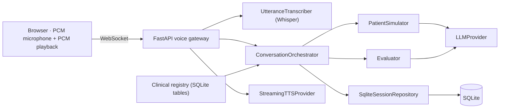

# ARI — entraînement à la communication médicale en allemand

ARI is a local-first trainer for the German medical language exam (FSP). A learner
creates a local profile, then practises with published, versioned clinical content:

- **Arzt–Patient**: a voice consultation with a simulated patient. The learner presses
  *Parler*, speaks, presses *J’ai fini*; Whisper transcribes the utterance, an LLM picks
  which case facts the patient may reveal, application code renders the exact patient
  sentence, TTS plays it back, and the browser acknowledges playback before any fact is
  credited as heard. A structured evaluation follows at the end of the session.
- **Arzt–Arzt** and **Fachbegriffe**: deterministic text exercises with authored answer
  variants. No AI call is involved.
- History and progression, separated by content version, rubric, method and mode.
  No overall score, no measured CEFR level, no certification.

Without published content the catalogue is empty. Content enters through the clinical
registry (import, two human reviews, publication), never through code.

## Try it offline

```sh
python3 -m venv .venv
make install-locked
PYTHONPATH=backend/src .venv/bin/python -m ari.demo --port 8010
```

Open <http://127.0.0.1:8010>. The demo creates a temporary database, runs the
migration, imports `cases/demo/ari_demo_bundle.v1.yaml`, records **simulated** reviews,
publishes one synthetic voice case and two synthetic exercises, and runs with fake
providers. In fake mode the voice page offers a text field instead of the microphone.
Nothing outside the temporary directory is read or written; Ctrl+C removes it.

## Run locally

```sh
make migrate
make dev
```

`make dev` serves <http://localhost:8000> against `var/ari.db` (override with
`ARI_DATABASE_URL`). The root is the learner home; `/voice.html` is the voice page.
The catalogue stays empty until you publish content with the registry CLI (below).

For live providers set, in `.env` or the environment:

| Variable | Purpose | Default |
| --- | --- | --- |
| `ARI_PROVIDER_MODE` | `fake` or `openai` | `fake` |
| `ARI_OPENAI_API_KEY` | patient simulation, evaluation and TTS (OpenAI) | |
| `ARI_STT_API_KEY` | Whisper transcription key (Groq by default) | |
| `ARI_STT_BASE_URL` | any OpenAI-compatible `/audio/transcriptions` host | `https://api.groq.com/openai/v1` |
| `ARI_STT_MODEL` | Whisper model | `whisper-large-v3` |
| `ARI_PATIENT_MODEL`, `ARI_EVALUATION_MODEL`, `ARI_TTS_MODEL`, `ARI_TTS_VOICE` | OpenAI models | see `backend/src/ari/config.py` |

Every session pins the voice stack it was created with (`stt`, `llm`, `tts` model ids
plus parameters). A session can only resume on exactly that configuration.

This is a loopback development build: cookie-based local profiles, no rate limits, no
spend controls. Do not expose it publicly.

## Architecture



Dependencies point inward:

- `domain`: session and turn state, strict Pydantic clinical authoring contracts, the
  practice (text exercise) rules; no vendor SDKs;
- `application`: ports (`LLMProvider`, `UtteranceTranscriber`, `StreamingTTSProvider`,
  `Evaluator`, `SessionRepository`), patient simulation, evaluation, orchestration,
  progression;
- `infrastructure`: SQLite persistence, the clinical registry and its CLI, OpenAI and
  Whisper adapters, deterministic fakes;
- `api`: HTTP routes, the voice WebSocket, cookie ownership middleware;
- `web`: two dependency-free pages, `index.html` (practice) and `voice.html`.

The patient never invents facts: the LLM returns source references only, and the
application renders the authored patient phrases. Unknown references are rejected and
traced. Prompt injection and off-topic requests are answered in character.

### Clinical registry

Content is a YAML `ari-clinical-bundle-v1` document (see `docs/CLINICAL_CASES.md`)
with sources, rubrics, terminology, cases and scenarios. `python -m
ari.infrastructure.cases.cli --help` validates, imports, inspects, records human
reviews, publishes and withdraws. Publication requires compatible source rights and one
clinical plus one linguistic approval of the exact hashes. Content rows are immutable
(SQLite triggers). See `docs/CLINICAL_REVIEW_FR.md` for the review procedure.

## Persistence

SQLite through SQLAlchemy Core-style models; one Alembic revision creates the schema
(`docs/MIGRATIONS.md`). Turns record the facts the patient selected and, separately,
the facts credited as heard once the browser confirms full playback. Learner
transcripts are persisted before the patient answers, so a failed response never loses
a turn. `POST /api/sessions/{id}/end` is idempotent and drains the voice connection.

## API

- `POST /api/learners`, `GET /api/profile`, `DELETE /api/profile`
- `GET/PATCH /api/learners/{id}/goal`, `GET /api/learners/{id}/sessions`
- `GET /api/cases`
- `POST /api/sessions`, `GET /api/sessions/{id}`, `POST /api/sessions/{id}/end`,
  `POST /api/sessions/{id}/analysis/retry`
- `WebSocket /ws/sessions/{id}/voice`: binary PCM16 24 kHz frames, `user.turn.finish`,
  `audio.playback_started`, `audio.playback_completed`, `turn.retry_tts`, `call.end`;
  in fake mode `debug.transcript`.
- `GET /api/exercises`, `POST /api/practice/runs`, `GET /api/practice/runs/{id}`,
  `POST /api/practice/runs/{id}/{answers|pause|resume|finish}`
- `GET /api/history`, `GET /api/progression`

## Quality checks

```sh
make test           # backend suite + JavaScript checks and unit tests
make lint           # ruff + mypy --strict
make migration-check
```

Provider tests are offline. The browser acceptance test needs Node 22+, pnpm and
Playwright:

```sh
pnpm --dir web install --frozen-lockfile --ignore-scripts
pnpm --dir web exec playwright install chromium
PYTHONPATH=backend/src .venv/bin/python -m ari.demo --port 8010   # in another terminal
pnpm --dir web test:e2e
```

## Known limits

- The pipeline is single-process: voice connection state lives in memory, so run one
  worker. SQLite has a single writer.
- No pronunciation scoring; vocabulary entries are candidates, never "mastered".
- Text exercises match whole answers after normalisation; unrecognised phrasings are
  reported as unrecognised, not as wrong.
- All shipped content is synthetic. Real cases require human clinical and linguistic
  review before any learner use.
